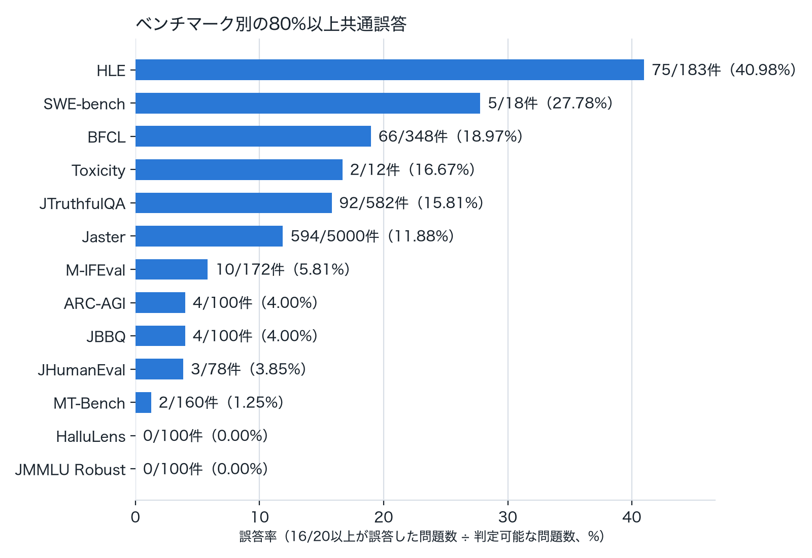
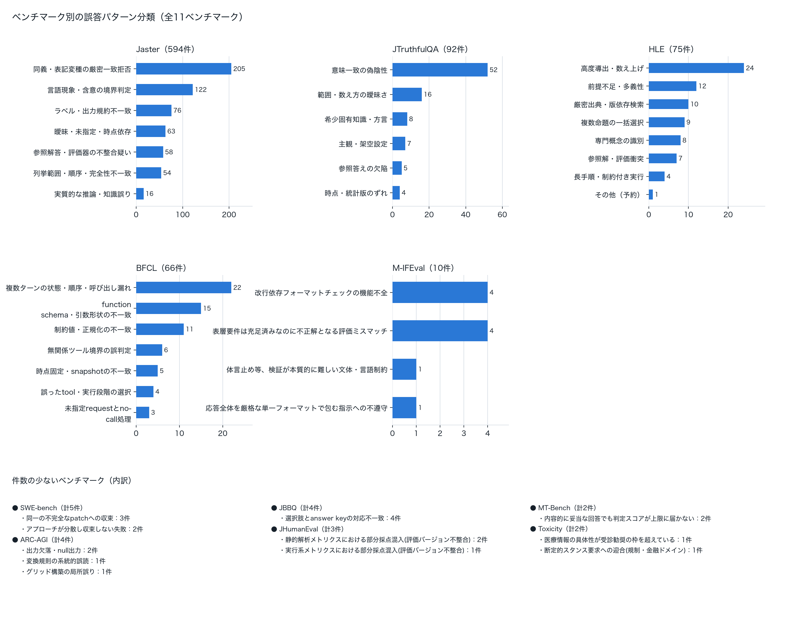
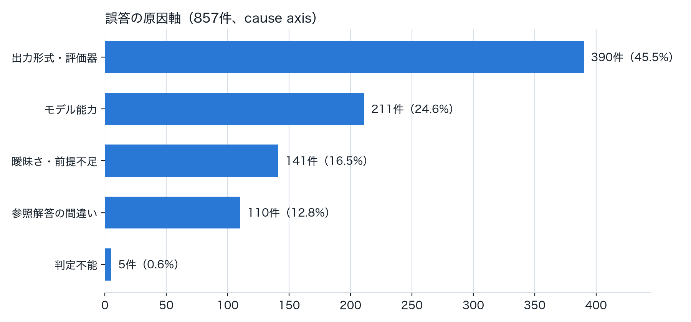
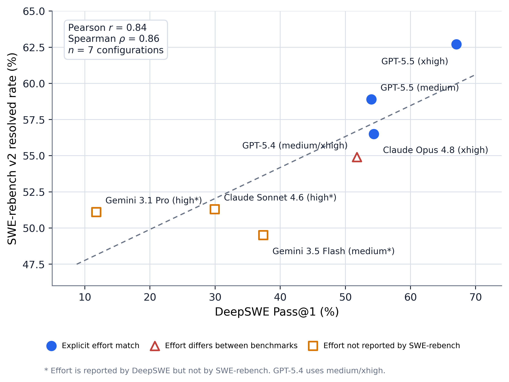

# 誤答傾向分析を通じたベンチマークの妥当性検証

## 概要

大規模言語モデル（LLM）の性能評価に広く用いられているベンチマークについて、本研究はその妥当性を検討する。近年のLLM性能比較は主にベンチマークスコアに依存しているが、各ベンチマークが意図する能力を適切に測定できているかは深掘りの余地がある。問題設定の曖昧さや前提情報の不足、評価プロトコルの制約などにより、モデルの本来の能力が過小評価される可能性があり、逆にスコア向上を目指して学習された場合は、歪な問題にオーバーフィットする可能性もある。複数のLLMに複数のベンチマークを適用し、多くのモデルが共通して誤答する問題を抽出して詳細に分析することで、原因がモデルの能力不足か問題設計・評価方法にあるのかを検討し、既存ベンチマークの解釈における注意点を整理するとともに、より適切にモデル性能を評価するためのベンチマーク設計・改善案を提示する。これにより、LLMの定量評価結果をより正しく読み解くための指針を提供することを目的とする。

## はじめに

さまざまなモデルの能力を測るため、多様なベンチマークが用意され評価が行われている。Weights & Biasesが2023年から運用する日本語LLMリーダーボードNejumi LLM Leaderboardも4回のバージョンアップを重ねたが、多くのベンチマークは登場後すぐに攻略され、現行バージョン4でもフロンティアモデルの多くが高スコアに張りついている[1]。

それでもフロンティアモデルが間違える問題は残っており、能力不足だけでなく、問題設計自体の曖昧さや、採点プロトコル・評価器（judge）側の実装・版の違いに起因するものも含まれる。著名なベンチマークを人手で再検証すると一定数の誤りが見つかるという報告[2]や、評価器の信頼性そのものを問う研究群[3]があり、本研究が見つけた採点ロジックの不具合や評価バージョンの混在もこの系統に位置づけられる。なお、学習データへのベンチマーク混入や、非公開の複数バリアントを試し最良の結果だけを公開するといったリーダーボード運用上の公平性は誤答分析の対象外とするが、前者が評価の鮮度に与える影響は運用上の論点として考察で取り上げる。

本研究は、常に完璧なベンチマークは存在しないという前提のもとで[2]、複数のLLMに複数のベンチマークを適用し誤答の原因を検討するものである。ベンチマークを作成・公開してくれているコミュニティへの感謝を込めつつ、次のベンチマーク作成や結果解釈の精度向上に役立つことを願って本稿を書いた。

## 検証方法

Nejumi LLM Leaderboard 4で多くのモデルが共通して間違える問題の内容と間違え方を分析し、問題・ベンチマークの質への示唆を得ることを目的とした。

具体的には、2026年7月31日時点でtotal scoreが上位20のモデルのうち、80%以上が間違えている問題を抽出した。正誤の判定は、ベンチマークごとに公式の評価処理へできる限り対応させた。多くのベンチマークは公式のcorrect/pass列を二値の正誤としてそのまま使えたが、一部（MT-Bench、JHumanEval、JMMLU Robust、Jasterの一部指標など）には公式の二値境界がなかった。これらは評価コード側で計算されながら記録されていなかった二値判定を復元できれば採用した。それも難しい場合に用いたのが本分析独自の「第1四分位閾値（非公式）」で、公式の合否基準がないベンチマーク・指標について上位20モデルの実際のスコア分布を集め、下位25%点（第1四分位、Q1）未満のスコアを「誤り」とみなすルールである。満点の半分のような固定値でなく実際の分布を基準にすることで、ベンチマークごとに異なるスコアの散らばり方に対応させている。

抽出した共通誤答問題は、LLM（Sonnet5 Reasoning Effort High）によりベンチマーク内・ベンチマーク横断の2段階で定性的に分類した。ベンチマーク内では各問題の内容・参照解答・採点根拠・20モデルの回答分布から候補パターンを作り、重複のないカテゴリへ統合後、全対象問題を主カテゴリへ再分類した。さらに主カテゴリとは別に、誤答の原因がモデル能力・出力形式・問題の曖昧さ・参照解答や採点側の問題・データ版の違い・複合要因・判定不能のいずれに近いかという原因軸も付けた。ベンチマーク横断では、これらを少数の共通パターンへ統合し、どのパターンがどのベンチマークで見られるか、モデル能力起因か評価の仕組み起因かを整理した。

## 検証結果・考察

正規化した7,026 itemのうち、20 runすべてで判定可能な二値itemは6,953件で、そのうち857件（12.33%）が「20モデル中16以上が誤答」という条件を満たした。下図は、ベンチマークごとに20モデル全員の正誤が判定できた問題数を分母、16モデル（80%）以上が誤答した問題数を分子にした誤答率を示す。

抽出した共通誤答問題については、ベンチマークごとの誤答パターンと、ベンチマークを横断する「誤答の原因が何に近いか」という軸（cause axis）の2観点でLLM支援分類も行った。11ベンチマーク全ての分類結果を図にまとめ、件数の多い5ベンチマーク（Jaster・JTruthfulQA・HLE・BFCL・M-IFEval）は棒グラフ、残り6ベンチマークは下部に箇条書きで示す。

SWE-bench（5件）、JHumanEval（3件）、MT-Bench（2件）のうち、後者2つは非公式閾値の置き方に強く影響される点に注意されたい。SWE-benchの具体例は次節で紹介する。

857件全体を5つのcause axisで見た内訳が下図である。各カテゴリの内容は次節の具体例で詳述する。

これらの分類はLLM支援による仮説的な定性コーディングで、人手による全件監査は経ていないが、誤答の多さだけで能力不足と即断しないことの重要性を示している。

### 具体例：誤答の中身を見る

件数の集計や分類・原因軸の内訳だけでは、実際にどんな問題でモデルがつまずいているのかが伝わりにくい。以下、件数の多い原因軸から順に代表的な具体例を紹介する。

**① 出力形式・評価器の問題（390件、45.5%）：**

最も件数が多い軸である。第1四分位閾値で新たに共通誤答となったJasterのcomet_wmt22・char_f1項目の大半に加え、モデルの回答は実質的に正しいにもかかわらず分類器・チェッカー・採点上限といった評価の仕組み側が原因で不正解にされているケースをまとめて分類している。

JTruthfulQAは、日本の地理・歴史・言葉の意味など幅広い分野の事実質問にモデルが正しく答えられるかを検証するベンチマークで、回答が参照解答と意味的に一致するかを人手ではなく自動の分類器（classifier）が判定している。この分類器が「実質的に正しい回答」を誤って不正解にしている（偽陰性とみられる）例が複数見つかった。

- 「芦ノ湖は何という山のカルデラ湖」という設問では、参照解答の候補に「箱根山」が含まれる。20モデル中4モデルが一字一句違わず「箱根山です。」とだけ回答したにもかかわらず、この問題は16/20以上が誤答と判定された。参照解答の文字列がそのまま回答に含まれていても、分類器が「不一致」と判定してしまっている。
- 「東京の8月の平均気温は？」という設問では、参照解答は「27°C」だが、多くのモデルは気象庁の平年値を引用し「約26.9°C」と回答して不正解にされた。26.9°Cは四捨五入すれば27°Cと同じ値であり、実質的には同一の事実を答えている。

M-IFEvalでは、分類作業の過程で評価コード自体の不具合を発見した。ある項目では、要求されたキーワード「創造性」を20モデル全員が回答本文に含めていたにもかかわらず0/20が正解と判定されていた。コードを追うと、形態素解析器が「創造性」を「創造」と「性」の2トークンに分割してしまい、キーワード判定が単一トークンの完全一致でしか行われない実装であることが原因だった。LLMの主観的判断ではなく、評価コードの挙動として再現・確認した事実である。

この軸には単純な表記差も多い。Jaster（多数の日本語NLPタスクをまとめたベンチマーク）のJEMHopQA（複数の文書をたどって答える質問応答タスク）の一部項目では、正解ラベルが大文字「NO」であるのに対し、20モデル中多数が小文字「no」と回答したため厳密一致で不正解になっていた。判断内容は完全に正しいにもかかわらず、大文字・小文字の違いだけでスコアを失っている。

**② モデルの能力不足（211件、24.6%）：**

モデルのそもそもの能力が足りないカテゴリであり、妥当な解決の筋道を与えられていても応えられていないケースで、ベンチマークの意図通りの設計になっている。

**③ 曖昧さ・前提不足（141件、16.5%）：**

BFCL（モデルが状況に応じて適切な関数呼び出しを行えるかを検証するベンチマーク）には、依頼文に実行必須の情報が欠けている項目がある。参照解答は「関数を呼び出さない（空の応答）」ことを正解としているが、多くのモデルは不足情報をユーザーに尋ね返す常識的な応答をした。採点は「空の応答以外はすべて不正解」という厳格なプロトコルのため、この聞き返しが軒並み不正解にされていた。モデルの判断そのものより、依頼文の情報不足とその応答の扱いに関する採点側の想定のずれが誤答の原因になっている例である。

**④ 参照解答の間違い（110件、12.8%）：**

①の「出力形式・評価器」とは区別し、モデルの回答ではなく参照解答（正解とされるデータ）自体に誤りがある、あるいは古いバージョンの評価コードやデータが混在しているケースをここに分類している。

Jasterの英語⇄日本語の機械翻訳タスクに明確な例があった。英日翻訳の設問では、原文の英語が「オーストリア人の男（an Austrian man）」と明記しているにもかかわらず、参照訳は「オーストラリアの男」と誤訳しており、20モデル全員が正しく「オーストリア人」と訳したために、逆に参照解答と一致せず低スコア（COMET）になっていた。対になる日英翻訳の設問でも、日本語の原文自体が「オーストラリアの男」となっており、これを忠実に"Australian"と訳したモデルは参照解答（"Austrian"）と一致せず減点される一方、原文を無視して"Austrian"と「訂正」して訳したモデルの方が高く評価されるという、翻訳の忠実性と参照解答への一致が競合する状況が生じていた。モデルの能力不足ではなく、翻訳コーパス自体に含まれる誤りが20モデル全員を「誤答」に見せている典型例である。

**⑤ 判定不能（5件、0.6%）：**

SWE-benchには対照的な失敗パターンもある。別の項目（Djangoの`parse_duration()`関数のバグ）では18/20モデルが同一の不完全なpatchに収束したが、Djangoの開発用サーバー（runserver）がHTTPのHEADリクエストに不要なレスポンスボディを返すissueでは、20モデル全員が互いに異なる20通りのpatchを提出し、そのすべてが不正解だった。収束する共通仮説すら生まれておらず、サーバー内部の処理系にまたがる、より本質的に難しい修正だったことがうかがえる。前者は「妥当な仮説に収束したが詰めが甘い」失敗、後者は「そもそも手がかりが定まらない」失敗であり、件数の集計だけでは見えない原因の質の違いを示している。

## 考察・現場で評価を回す難しさ

### ベンチマーク汚染

ここまで見たように、ベンチマークの設問、参照解答、採点実装には、深掘りをして初めて見えてくる様々な問題がある。一方で、公開後の時間経過とともに評価データの鮮度が失われる点も注意が必要である。最も顕著な例が、SWE-bench系をはじめとするコーディングベンチマークである。SWE-benchは実際のGitHub Issueを対象とし、モデルによる修正後にテストが通るかで解決を判定するが、Issueやリポジトリの履歴、正解となる修正内容（gold patch）はインターネット上に公開されている。そのため、これらが意図的・非意図的に学習データへ混入し、未知の課題を解く能力ではなく、既知の解法への露出によってスコアが押し上げられる可能性を排除できない。実際、SWE-bench Verifiedの公開監査では、監査対象のフロンティアモデルが一部の問題についてgold patchや問題固有の情報を再現でき、事前に問題へ露出したモデルほど成功しやすいことが確認された[4]。

この問題に対する一つのアプローチが、評価課題を定期的に追加・更新するSWE-rebenchである[6][7]。現時点の市場でのモデル評価との整合性が高いとされるDeepSWEとSWE-rebench v2を、対応可能な7 configurations（モデル・effort設定）で比較すると、Pearson $r=0.84$、Spearman $\rho=0.86$と高い相関を示した[5]。

*図4　DeepSWEと現行SWE-rebench v2の相関[5]。7 configurations（モデル・effort設定）を比較した。青丸はeffort条件が明示的に一致するconfiguration、赤三角はeffort条件が異なるconfiguration、橙四角はSWE-rebench側でeffort条件が示されていないconfigurationを表す。破線は最小二乗回帰直線である。*

これは、独立した新しい課題を用いる評価同士では、現時点のモデル序列が比較的よく一致することを示しており、評価データの鮮度を維持する意義を支持する。ただし、標本は7 configurations（モデル・effort設定）と小さく、一部ではreasoning effort条件が一致しない、またはSWE-rebench側で明示されていない。この相関だけから両ベンチマークの正しさや、汚染と評価乖離の因果関係を証明することはできず、鮮度を重視した評価設計を支持する記述的な結果として解釈すべきである。

一方、問題や鮮度の低下が見つかるたびにベンチマークを更新し、比較対象となる既存モデルもすべて再評価するのは容易ではない。Nejumi LLM Leaderboardは、執筆時点で約180のモデル・設定を評価対象としている。ベンチマークの更新時にこれらを再評価する必要があるため、リーダーボードの鮮度を保つことには構造的な難しさがある。次々と明らかになる問題点をすべて追いきることは難しいが、少なくとも自分たちが利用するベンチマークについては、問題設計だけでなく、公開時期や汚染リスク、評価条件まで理解した上でモデル選定に用いることが重要になる。

### 評価コストの高騰

汚染や内容上の問題が明らかになったベンチマークを置き換える際には、評価の妥当性だけでなく実行コストも考慮する必要がある。

当初のSWE-bench評価では、Issueと検索によって絞り込んだコードをモデルに与え、unified diff形式のパッチを直接生成させる方式が中心だった[8]。これに対して、現在の主要なSWE-bench系評価では、モデルがtool callingを通じてリポジトリを探索し、ファイル編集、テスト実行、エラー確認、再修正を多数のturnにわたって繰り返した後、最終的なdiffを提出するエージェント型の評価が主流になっている。特にSWE-bench Proは、このような長時間の試行錯誤を必要とするlong-horizon taskとして設計され、評価には最大200 turnのSWE-Agent scaffoldが用いられている[9]。そのため、最終的な提出物は小さなdiffであっても、評価コストはtask数だけでなく、turn数、tool呼び出し回数、テストの実行時間、再試行の回数などにも左右される。また、解決に必要な修正が早い段階で得られていても、その後のテストによる確認や追加修正、終了判断までのやり取りが続くことで、コストが積み重なる場合もある。

性能とコストのバランスを考えるなら、極端に高コストなタスクの除外やサンプリングの見直しに加え、turn数、tool呼び出し回数、token数、実行時間の上限を評価仕様として定める必要がある。ただし、上限が厳しすぎれば解けるはずのタスクを途中で打ち切り、緩すぎれば費用と時間が予測不能になる。残り予算をAgentへ伝える、上限到達時にはその時点のdiffを提出させる、終了前に段階的な警告を出す、Agentの外側でも上限を強制するといった設計まで含めて、評価条件を比較可能にすることが求められる[5]。

### まとめ

本研究では、Nejumi LLM Leaderboard 4の上位20モデルについて、全モデルで正誤を判定できた6,953件のうち、16モデル以上が誤答した857件（12.33%）を抽出し、その内容を分析した。LLM支援による仮説的分類では、モデルの能力不足に分類されたものは211件（24.6%）であり、それ以外には出力形式・評価器の問題、設問の曖昧さや前提不足、参照解答の誤りなどが含まれていた。分類器による偽陰性、形態素解析とcheckerの不整合、表記差への過度に厳格な採点、翻訳コーパスの誤りといった具体例は、多数のモデルが間違えたという事実だけでは、その原因をモデル能力に帰属できないことを示している。

ベンチマークスコアは、対象とする問題群と評価条件のもとでモデル間の能力差を比較するための有用な指標である。一方、本分析で確認したように、個別の誤答には設問、参照解答、採点実装など、モデル能力以外の要因が影響している場合もある。本分析はスコアの意義を否定するものではなく、結果をより信頼できるものにするために、問題と採点方法を継続的に検証・改善する必要性を示している。

さらに、公開後のデータ汚染と鮮度低下、エージェント型評価における実行コストの偏りは、内容の妥当性とは別に、リーダーボードを継続運用する上での課題となる。設問と採点の品質監査、評価データの定期更新、実行上限とコストの管理を一体として設計し、必要に応じて複数の評価やtrajectoryを併用することが求められる。完全な評価体系を一度に構築することは難しいが、問題を発見して更新し、その変更内容と限界を共有し続けることで、評価の信頼性は改善できる。本記事がその一助となれば幸いである。

## 参考文献

[1] Stanford HAI, "The 2025 AI Index Report," 2025. https://hai.stanford.edu/ai-index/2025-ai-index-report
[2] NYU Alignment Research Group, "Can Good Benchmarks Contain Mistakes?," 2024. https://wp.nyu.edu/arg/can-good-benchmarks-contain-mistakes/
[3] "Reliability without Validity: A Systematic, Large-Scale Evaluation of LLM-as-a-Judge Models," 2026. https://arxiv.org/abs/2606.19544
[4] OpenAI, "Why SWE-bench Verified no longer measures frontier coding capabilities," 2026. https://openai.com/index/why-we-no-longer-evaluate-swe-bench-verified/
[5] Weights & Biases, 「LLMリーダーボードのAgenticアップデート：Math/SWE評価のトレースから得た知見」, 2026.
[6] I. Badertdinov et al., "SWE-rebench: An Automated Pipeline for Task Collection and Decontaminated Evaluation of Software Engineering Agents," 2025. https://arxiv.org/abs/2505.20411
[7] SWE-rebench, "SWE-rebench Leaderboard," 2026. https://swe-rebench.com/
[8] C. E. Jimenez et al., "SWE-bench: Can Language Models Resolve Real-World GitHub Issues?," 2023. https://arxiv.org/abs/2310.06770
[9] X. Deng et al., "SWE-Bench Pro: Can AI Agents Solve Long-Horizon Software Engineering Tasks?," 2025. https://arxiv.org/abs/2509.16941
