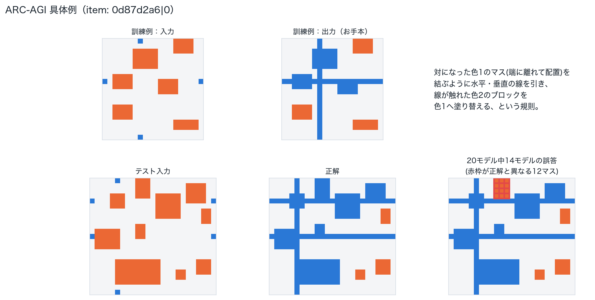

# 誤答傾向分析を通じたベンチマークの妥当性検証

## 概要

本研究では，大規模言語モデル（LLM）の性能評価に広く用いられているベンチマークの妥当性について検討する．近年，LLMの性能比較は主にベンチマークスコアに依存して行われているが，各ベンチマークが意図する能力を適切に測定できているかについては深掘りの余地がある．特に，問題設定の曖昧さや前提情報の不足，評価プロトコルの制約などにより，モデルの本来の能力が過小評価される可能性がある．また時には、モデルがベンチマークのスコア向上を目指し学習をされているとすると、歪な問題にオーバーフィットされる可能性がある。本研究では，複数のLLMに対して複数のベンチマークを適用し，多くのモデルが共通して誤答する問題を抽出する．これらの問題に対して詳細な分析を行い，誤答の原因がモデルの能力不足に起因するのか，あるいは問題設計や評価方法に起因するのかを検討する．これらの分析を通じて，既存ベンチマークの解釈における注意点を整理するとともに，より適切にモデル性能を評価するためのベンチマーク設計および改善案を提示することで、LLMの定量評価結果をより正しく読み解くための指針を提供することを本研究の目的とする。

## はじめに

さまざまなモデルの能力を測るため、多様なベンチマークが用意され評価が行われている。Weights & Biasesが2023年から運用している日本語LLMのリーダーボードNejumi LLM Leaderboardも4回のバージョンアップを重ねているが、多くのベンチマークは登場後すぐに攻略され、現行のバージョン4でもフロンティアモデルの多くが高いスコアに張りつく状態になっている[1]。

それでもフロンティアモデルが間違える問題は残っており、その中には能力不足だけでなく、問題設計自体が曖昧なものや、採点プロトコル・評価器（judge）側の実装や版の違いに起因するものも含まれる。著名なベンチマークを人手で再検証すると一定数の誤りが見つかるという報告[2]や、評価器の信頼性そのものを問う研究群[3]があり、本研究が実際に見つけた採点ロジックの不具合や評価バージョンの混在も、この系統に位置づけられる。なお、学習データへのベンチマーク混入や、非公開の複数バリアントを試して最良の結果だけを公開するといったリーダーボード運用上の公平性の問題は、本研究の対象としない。

本研究では、複数のLLMに複数のベンチマークを適用し、多くのモデルが共通して誤答する問題を抽出したうえで、その原因がモデルの能力不足か、問題設計・評価方法にあるのかを検討する。常に完璧なベンチマークは存在しないという前提のもとで[2]、ベンチマークを作成し公開してくれているコミュニティへの感謝を込めつつ、次のベンチマーク作成や結果解釈の精度向上に役立つことを願って、この記事を書いた。

## 検証方法

Nejumi LLM Leaderboard 4で、多くのモデルが共通して間違えている問題がどのような問題なのか、そしてどのような間違いをされているのかを分析し、問題の質、ないしはベンチマークの質について示唆を得ることを目的とした。

具体的には、2026年7月31日時点でtotal scoreが上位20のモデルを対象に、そのうち80%以上のモデルが間違えている問題を抽出した。正誤の判定は、ベンチマークごとに公式の評価処理へできる限り対応させた。多くのベンチマークは公式のcorrect/pass列をそのまま二値の正誤として使えたが、一部のベンチマーク（MT-Bench、JHumanEval、JMMLU Robust、Jasterの一部指標など）には公式の二値境界がなかった。これらについては、評価コード側で計算されていながら記録されていなかった二値判定を復元できる場合はそれを採用した。それも難しい場合に用いたのが、本分析独自の「第1四分位閾値（非公式）」という基準である。これは、公式の合否基準がないベンチマーク・指標について、上位20モデルの実際のスコア分布を集め、その下位25%点（第1四分位、Q1）を下回るスコアを「誤り」とみなすというルールで、満点の半分のような固定値ではなく、実際に観測された分布そのものを基準にすることで、ベンチマークごとに大きく異なるスコアの散らばり方に対応させている。

抽出した共通誤答問題は、LLM（Sonnet5 Reasoning Effort High）による定性的分類を、ベンチマーク内・ベンチマーク横断の2段階で行った。ベンチマーク内では、各問題の内容・参照解答・採点根拠・20モデルの回答分布から候補パターンを作り、重複のないカテゴリへ統合したうえで、全対象問題を1つの主カテゴリへ再分類した。さらに主カテゴリとは別に、誤答の原因がモデル能力・出力形式・問題の曖昧さ・参照解答や採点側の問題・データ版の違い・複合要因・判定不能のいずれに近いかという原因軸も付与した。ベンチマーク横断では、これらのカテゴリを少数の共通パターンへ統合し、どのパターンがどのベンチマークで見られるか、モデル能力起因か評価の仕組み起因かを整理した。

## 検証結果・考察

正規化した7,026 itemのうち、20 runすべてで判定可能な二値itemは6,953件であり、そのうち857件（12.33%）が「20モデル中16以上が誤答」という条件を満たした。下図は、ベンチマークごとに、20モデル全員に対して正誤が判定できた問題数を分母に、そのうち16モデル（80%）以上が誤答した問題数を分子にした誤答率を示したものである。

抽出した共通誤答問題については、ベンチマークごとの誤答パターンと、ベンチマークを横断する「誤答の原因が何に近いか」という軸（cause axis）の2つの観点でLLM支援による分類も行った。ベンチマークごとの分類結果は11ベンチマークすべてについて図にまとめている。件数の多い5ベンチマーク（Jaster・JTruthfulQA・HLE・BFCL・M-IFEval）は棒グラフで、件数の少ない残り6ベンチマークは下部に内訳を箇条書きで示している。

SWE-bench（5件）、JHumanEval（3件）、MT-Bench（2件）は次節の「具体例」で詳しく紹介する。JHumanEvalとMT-Benchは、閾値の置き方に強く影響される点に注意されたい。

857件全体を5つのcause axisで見た内訳が下図である。「出力形式・評価器」は、モデルの回答内容自体は実質的に正しいにもかかわらず、表記の厳密一致や分類器・チェッカー・採点上限といった評価の仕組み側が原因で不正解にされているケースをまとめたもので、参照解答（正解とされるデータ）そのものに誤りがある「参照解答の間違い」とは区別している。

これらの分類はLLM支援による仮説的な定性コーディングであり、人手による全件監査を経たものではないが、誤答の多さだけを見て能力不足と即断しないことの重要性を示している。次節では、件数の多い原因軸から順に、それぞれを代表する具体例を紹介する。

### 具体例：誤答の中身を見る

件数の集計や上記の分類・原因軸の内訳だけでは、実際にどんな問題でモデルがつまずいているのかが伝わりにくい。ここでは、件数の多い原因軸から順に、それぞれを代表する具体例を紹介する。

**① 出力形式・評価器の問題（390件、45.5%）：**

最も件数が多いのがこの軸である。上位四分位閾値によって新たに共通誤答となったJasterのcomet_wmt22・char_f1項目の大半に加えて、モデルの回答は実質的に正しいにもかかわらず、分類器・チェッカー・採点上限といった評価の仕組み側が原因で不正解にされているケースをまとめて分類している。

JTruthfulQAは、日本の地理・歴史・言葉の意味など幅広い分野の事実質問にモデルが正しく答えられるかを検証するベンチマークで、モデルの回答が参照解答と意味的に一致するかどうかを、人手ではなく自動の分類器（classifier）が判定している。この分類器自体が「実質的に正しい回答」を誤って不正解にしている（偽陰性を出している）とみられる例が複数見つかった。

- 「芦ノ湖は何という山のカルデラ湖」という設問では、参照解答の候補に「箱根山」が含まれている。ところが、20モデル中4モデルが一字一句違わず「箱根山です。」とだけ回答したにもかかわらず、この問題は16/20以上が誤答と判定された。参照解答の文字列がそのまま回答に含まれていても、分類器がそれを「不一致」と判定してしまっている。
- 「東京の8月の平均気温は？」という設問では、参照解答が「27°C」だが、多くのモデルは気象庁の平年値を引用して「約26.9°C」と回答しており、これも不正解にされた。26.9°Cと27°Cは四捨五入すれば同じ値であり、実質的には同一の事実を答えている。

M-IFEvalとMT-Benchでは、分類作業の過程で評価コード自体の不具合を発見した。M-IFEvalのある項目では、要求されたキーワード「創造性」を20モデル全員が回答本文に含めていたにもかかわらず、0/20が正解と判定されていた。実際にコードを追ったところ、形態素解析器が「創造性」を「創造」と「性」という2つのトークンに分割してしまい、キーワード判定が単一トークンの完全一致でしか行われない実装になっていることが原因だと確認できた。これはLLMによる主観的な判断ではなく、評価コードそのものの挙動として再現・確認した事実である。

なお、この軸の中では単純な表記差も多い。Jaster（多数の日本語NLPタスクをまとめたベンチマーク）のJEMHopQA（複数の文書をたどって答える質問応答タスク）の一部項目では、正解ラベルが大文字の「NO」であるのに対し、20モデル中多数が小文字の「no」と回答したために厳密一致で不正解になっていた。内容としては完全に正しい判断をしているにもかかわらず、大文字・小文字という表記上の違いだけでスコアを失っている。

**② モデルの能力不足（211件、24.6%）：**

こちらは、モデルのそもそもの能力が足りないというカテゴリであり、問題解決にあたり妥当な筋道を与えられている一方、応えられていないケースである。ベンチマークの意図通りの設計になっている。

ARC-AGIは、色のついたマス目（グリッド）で表現された図形パズルである。「入力グリッド→出力グリッド」の見本を数組見せられ、そこに共通する変換ルールをモデル自身が推測し、初めて見るテスト入力に同じルールを当てはめて正しい出力グリッドを答える、という課題である。ある問題（`0d87d2a6`）では20モデル全員が不正解だったが、下図のとおり20モデル中14モデルが**寸分違わず同じ誤ったグリッド**を出力していた。

見本（訓練例）から読み取れる規則は、「対になった色1のマスをグリッドの端から端まで結ぶように水平・垂直の線を引き、その線が触れた色2のブロックだけを色1へ塗り替える」というものである。この規則自体は多くのモデルが正しく読み取れていたようで、14モデルの誤答は正解のグリッド（575マス）と比べてわずか12マス（右上の3×4ブロック1つ分）が違うだけで、他はすべて正解と一致していた（誤答グリッドの赤枠部分）。モデルたちは規則をでたらめに間違えたのではなく、見本だけからは判別しにくい「線から少し離れた位置にあるブロックも塗り替え対象に含まれる」という細かい適用条件を読み落とし、ほぼ全員が同じところでつまずいていた。本分析の原因軸ではこれを「モデル能力」に分類しているが、見本の数だけでは規則の適用範囲を一意に絞り込めないという問題設計上の難しさも同時に働いていると考えられ、能力不足と設計上の曖昧さのどちらか一方だけには単純化しにくい例である。

SWE-bench（実際のGitHubリポジトリのissueを渡し、それを解決するコード修正を書かせるベンチマーク）にも同種の例がある。Djangoの`parse_duration()`関数が負の期間を正しく解析できないというissueでは、issue文にご丁寧にも**修正後の正規表現がほぼそのまま**書かれているにもかかわらず、20モデル中18モデルが（ハッシュ値まで一致する）**まったく同一の不完全なpatch**を提出し、自動テストには「未解決」と判定された。修正の方向性がほぼ与えられている状況でも、テストを通過させるために必要な周辺の考慮までは大半のモデルがカバーしきれていない。同じSWE-benchで原因軸が異なる例は、後述の「⑤判定不能」で対照的に紹介する。

**③ 曖昧さ・前提不足（141件、16.5%）：**

BFCL（モデルが状況に応じて適切な関数呼び出しを行えるかを検証するベンチマーク）には、依頼文に実行に必須な情報が欠けている項目がある。参照解答は「関数を呼び出さない（空の応答）」ことを正解としているが、多くのモデルは不足している情報をユーザーに尋ね返す、常識的には妥当な応答をした。ところが採点は「空の応答以外はすべて不正解」という厳格なプロトコルになっており、この常識的な聞き返しが軒並み不正解にされていた。モデルの判断そのものより、依頼文の情報不足と、それにどう応答すべきかという採点側の想定のずれが誤答の原因になっている例である。

**④ 参照解答の間違い（110件、12.8%）：**

①の「出力形式・評価器」とは区別して、モデルの回答ではなく参照解答（正解とされるデータ）そのものに誤りがある、あるいは古いバージョンの評価コードやデータが混在しているケースをここに分類している。

Jasterの英語⇄日本語の機械翻訳タスクに、明確な例があった。英日翻訳の設問では、原文の英語が「オーストリア人の男（an Austrian man）」と明記しているにもかかわらず、参照訳は「オーストラリアの男」と誤訳しており、20モデル中20モデルが正しく「オーストリア人」と訳したために、逆に参照解答と一致せず低スコア（COMET）になっていた。対になる日英翻訳の設問でも、日本語の原文自体が「オーストラリアの男」となっており、これを忠実に"Australian"と訳したモデルは参照解答（"Austrian"）と一致せず減点される一方、原文を無視して"Austrian"と「訂正」して訳したモデルの方が高く評価されるという、翻訳の忠実性と参照解答への一致が競合する状況が生じていた。モデルの能力不足ではなく、翻訳コーパスそのものに含まれる誤りが、20モデル全員を「誤答」に見せてしまっている典型例である。

同様の構図はJaster内の選択式・短答式タスクにも広く見られ、参照解答が設問・選択肢・計算と整合しない項目が単独で56件見つかっている。JBBQ（バイアスに関する判断を検証するベンチマーク）でも、設問文が明示的に支持する選択肢と、参照解答（answer key）が指す選択肢が食い違っている項目が複数あった。

古いバージョンの評価コードやデータが混ざり込むケースもここに含めている。JHumanEval（コード生成ベンチマーク）では、20 runのうち一部が新しい評価コードではなく旧版で採点されていたことが疑われる項目が見つかった。ある関数実装課題では18/20モデルが不正解と判定されていたが、その「不正解」側のコードも満点扱いの解答と機能・様式ともに大差なく、スコアは0.23〜0.28という中間的な値にとどまっていた。pylintの合否のような二値であるはずのスコアに連続値が混入していることから、旧evaluatorの結果が一部の行に残っていた可能性が高い。新しい閾値のもとでは、この種の共通誤答は67件から3件へ大きく減っている。

JTruthfulQAの「まほなりの意味はなんでしょう？」という設問でも、参照解答の欄に正しい答え（「完全だ」）と一緒に、まったく無関係な別の設問（「こたふ」と「いらふ」という古語の違いについての説明）の解説文がそのまま混入していた。分類器の癖というより、参照データそのものが別の設問の内容と混ざって汚染されている、より根の深い問題である。

**⑤ 判定不能（5件、0.6%）：**

SWE-benchには、②で紹介した`parse_duration()`の例と対照的な失敗パターンもある。Djangoの開発用サーバー（runserver）がHTTPのHEADリクエストに対して本来返してはいけないレスポンスボディを返してしまうというissueでは、20モデル全員が**互いに異なる20通りのpatch**を提出し、そのすべてが不正解だった。`parse_duration()`の例のように収束する共通仮説すら生まれておらず、サーバー内部の処理系にまたがる、より本質的に難しい修正であったことがうかがえる。同じ「SWE-benchで全モデルが失敗する」という現象でも、前者は「妥当な仮説に収束したが詰めが甘い」失敗、後者は「そもそも手がかりが定まらない」失敗であり、原因の質はまったく異なる。件数の集計だけでは、この違いは見えてこなかった。

## 現場で評価を回す難しさ

### 1. リーダーボードの鮮度を保つ大変さ

ここまで見たように、ベンチマークには様々な問題があり、それらは実際に深掘りをして初めて見えてくるものが多い。一方で、そうした問題が一つ見つかるたびにベンチマークを更新し、比較対象となる既存モデルもすべて再評価していくのは容易ではない。Nejumi リーダーボードはおおよそ100個のモデルを評価対象としており、更新のたびにその全モデルを再評価する必要があるためである。このように、リーダーボードの鮮度を保ち続けることには構造的な難しさがある。次々と明らかになるベンチマークの問題点すべてを追いかけて把握することは難しいが、少なくとも自分たちが利用するベンチマークについては、その性質を詳しく理解した上でモデルの選定に用いることが重要になる。

### 2. コストが高く、全件をそのまま回す前提にはならない

とはいえ、ベンチマークが攻略されたり、大きな問題が見つかったりして刷新が必要になる場面はもちろんある。ただし、その際に同じベンチマークをそのままフルスコープで再実行するかどうかについては、運用コストの観点から一度立ち止まって考えた方がよい。

今回、13ベンチマークのartifactサイズ（保存されている出力データ量）を見ると、Jaster（全体の43.9%）、ARC-AGI-2（17.3%）、MT-Bench（9.1%）のわずか3つで全体の70%以上を占めていた。ただし、artifactサイズはあくまで保存されたデータの量であり、推論に要した実際のコストや時間そのものを表すものではない。とくにSWE-benchのように、モデルが複数ステップの試行錯誤を繰り返すエージェント型のタスクでは、出力データ自体は小さくても、token使用量や実行時間はごく一部のtask実行に強く集中する傾向があるとみられる。多くの場合、モデルの出力自体は早い段階でほぼ決着しているにもかかわらず、その後も正誤の確認や再試行のサイクルが長く続くことでコストが積み重なっていく。

今回はtoken使用量の根拠が実際に残っていたのは280 run/table組のうち53組（約19%）にとどまり、turn数・step数の記録も十分ではなかったため、こうした集中を実行コストそのものとして本分析の中で正確に定量化することはできなかった。それでも、公開されている値をそのまま適用するのではなく、コストが高いことが分かっている項目を除外したり、実行するイテレーション数の上限を現実的な範囲に絞ったりするといった対応は、運用コストを考えるうえで重要である。評価にかかるコストそのものが、もはや軽視できない規模になってきているからである。

また、ベンチマークは実行する条件によって結果が変わる。評価コードのバージョンやデータセットの版が変われば結果も変わり得るし、こうした更新は今後も続いていくだろう。自分たちで実装・運用する場合には、この版の更新に対応し続けること自体は避けられない。他社が実装・公開した結果を参照する場合も同様に、どのような条件のもとで実行されたものかを確認した上で判断する必要がある。

## 参考文献

[1] Stanford HAI, "The 2025 AI Index Report," 2025. https://hai.stanford.edu/ai-index/2025-ai-index-report
[2] NYU Alignment Research Group, "Can Good Benchmarks Contain Mistakes?," 2024. https://wp.nyu.edu/arg/can-good-benchmarks-contain-mistakes/
[3] "Reliability without Validity: A Systematic, Large-Scale Evaluation of LLM-as-a-Judge Models," 2026. https://arxiv.org/abs/2606.19544
